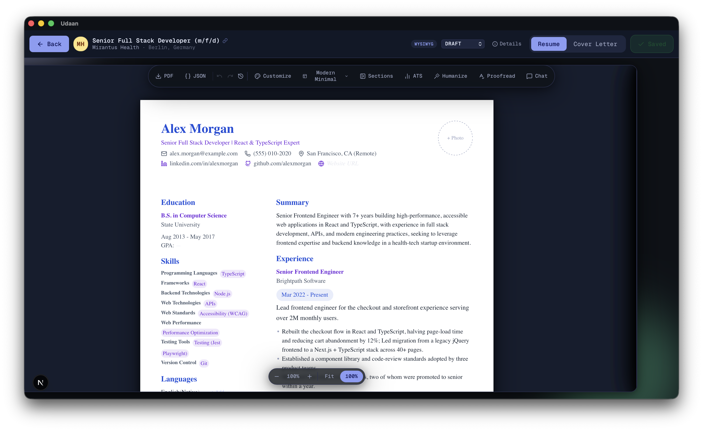

# Udaan


**Udaan** (उड़ान — "flight, takeoff") is a local-first, AI-powered desktop app that turns a job description and your base profile into a tailored, ATS-friendly resume and cover letter. Every application deserves its own shot at flight, not a copy-pasted resume sent into the void — for job seekers who want full control of their data and a choice of AI provider, instead of a subscription-locked cloud service.

## Demo



More screenshots and demo clips (Fit Check, chat editing, cover letters, customization) are on the [landing page](https://udaan.pranavraut.dev).

## Features

- **Base profile**: one reusable profile (experience, skills, projects, education) stored locally in SQLite
- **Bookmarks**: save a job URL without generating a resume yet — JD parsing runs in a background queue (up to 5 concurrent), so you can keep pasting URLs and promote a bookmark to a tracked job later from `/bookmarks`
- **Job tracking**: manage applications with status (Bookmarked, Draft, Applied, Interview, Offer, Rejected)
- **AI job parsing**: paste a job description and extract structured requirements client-side via your chosen LLM
- **AI resume & cover letter tailoring**: generate content tailored to each job from your base profile
- **Inline WYSIWYG editor**: edit the generated resume directly on the rendered document, with zoom controls and version history (`/job/[jobId]`)
- **13 templates**: per-job color/font/layout customization, rendered by a shared template engine so DOM/PDF/TXT output stay in sync
- **AI humanizer**: rewrite resume/cover letter content to read less like AI output, with reviewable before/after changes
- **Deep Analysis**: deterministic lint checks plus an LLM pass catch grammar, consistency, keyword coverage, and unquantified-claim issues in a review drawer — each finding anchored to an editable line; lint-sourced fixes auto-apply
- **Fit Check**: a blunt, substantive fit assessment against the job description — missing experience, seniority, and domain gaps a keyword scan can't see, plus knockout risks (work authorization, a license, a location), each with a concrete next step, closing with your real strengths; no invented "ATS score"
- **EU/German CVs**: optional profile photo, nationality, date of birth, and hobbies section; DE/EU region prompt guidance; an Anschreiben cover letter style
- **Documents view**: browse all generated resumes and cover letters across jobs (`/documents`)
- **Notifications**: a bell in the sidebar shows background task progress and results (e.g. bookmark parsing), with history and a clear-all action
- **PDF & TXT export**: generate application-ready documents
- **10 LLM providers**: OpenAI, Google Gemini, Anthropic (Claude), xAI Grok, Groq, DeepSeek, Mistral, OpenRouter, Perplexity, local Ollama — or a managed pay-as-you-go gateway (no key required); switch per job
- **MCP server (optional)**: drive the same job-parsing/tailoring/fit-check/deep-analysis/humanizing flows, plus reading and editing your base profile with a diff preview before anything saves, from Claude Desktop or another MCP host on your own chat subscription — no API key configured in this app required. Opt-in toggle + one-click connector download in **Settings**, off by default; see [docs/MCP.md](./docs/MCP.md)
- **Secure key storage**: API keys are AES-256-GCM encrypted on disk (desktop), keyed off a per-install master key held in the OS keychain, or `localStorage` (web) — never on the server
- **Backup & restore**: export the entire local database to a JSON file and restore it later, from **Settings**
- **Local-first**: all data in a local SQLite database; no mandatory cloud dependency

## Download & Install

Prebuilt desktop apps for macOS, Windows, and Linux are published on the [Releases](https://github.com/Pranavraut033/resume-builder/releases) page for every `v*.*.*` tag from v1.13.1 onward — earlier tags are macOS-only.

| Platform              | File                                       | Notes                                          |
| --------------------- | ------------------------------------------ | ---------------------------------------------- |
| macOS (Apple Silicon) | `Udaan_<version>_aarch64.dmg`              | M1/M2/M3/M4                                    |
| macOS (Intel)         | `Udaan_<version>_x64.dmg`                  | Intel Macs                                     |
| Windows               | `Udaan_<version>_x64-setup.exe`            | NSIS installer                                 |
| Linux                 | `Udaan_<version>_amd64.AppImage` or `.deb` | AppImage is portable; `.deb` for Debian/Ubuntu |

The app is **self-signed** (not signed by a CA-trusted/registered publisher), so each OS will show a one-time warning before the first launch. This is expected — follow the steps below to open it.

### macOS

1. Open the downloaded `.dmg` and drag **Udaan** into **Applications**
2. On first launch, Gatekeeper will say _"Udaan cannot be verified"_ — **right-click the app → Open → Open** in the dialog
3. If you instead see _"The application is damaged and can't be opened"_, clear the quarantine flag:
   ```bash
   xattr -d com.apple.quarantine /Applications/Udaan.app
   ```
   This manual step is only needed once, on your first install (or if you're updating from v1.10 or earlier) — from v1.11.0 onward, the app clears its own quarantine flag automatically after every in-app update.

### Windows

1. Run the `*-setup.exe` installer
2. Windows SmartScreen will show _"Windows protected your PC"_ — click **More info**, then **Run anyway**
3. Follow the installer prompts

### Linux

- **AppImage** (portable, no install):
  ```bash
  chmod +x Udaan_*_amd64.AppImage
  ./Udaan_*_amd64.AppImage
  ```
- **.deb** (Debian/Ubuntu):
  ```bash
  sudo dpkg -i Udaan_*_amd64.deb
  ```

## Tech Stack

- **Framework**: Next.js 16 (App Router, Server Actions)
- **Desktop**: Tauri 2
- **Database**: SQLite via Prisma ORM 7
- **Styling**: Tailwind CSS v4
- **State**: Zustand (LLM provider/model selection, notifications, background bookmark-parsing queue)
- **LLM providers**: OpenAI, Google Gemini, Anthropic, Grok, Groq, DeepSeek, Mistral, OpenRouter, Perplexity, Ollama, or the managed gateway (all client-side); provider base classes/prompt infra live in the `@pranavraut033/llm-core` package (`packages/llm-core/`), ATS scoring logic in `@pranavraut033/ats-checker` (`packages/ats-checker/`)
- **PDF export**: `@react-pdf/renderer` / `pdf-lib`
- **Drag & drop**: `@dnd-kit`
- **Testing**: Vitest + Testing Library, Playwright for e2e

## Architecture

**Hard rule: Server = database only, LLM calls = client only.**

```
┌─────────────────────────────────────────┐
│  Client (Browser / Tauri)               │
│  ├─ UI Components                       │
│  ├─ Client-side LLM (src/lib/llm)       │
│  │   ├─ parseJobDescription()           │
│  │   ├─ generateResume()                │
│  │   └─ generateCoverLetter()           │
│  └─ API keys (Tauri encrypted store)    │
└────────────┬────────────────────────────┘
             │ Server Actions (DB only)
             ▼
┌─────────────────────────────────────────┐
│  Server (Next.js)                       │
│  ├─ Server Actions (src/actions/)       │
│  │   ├─ Profile CRUD                    │
│  │   └─ Job / Resume / CoverLetter CRUD │
│  └─ Prisma + SQLite                     │
└─────────────────────────────────────────┘
```

**Why client-side LLM?**

- API keys never leave the client (Tauri encrypted storage / `localStorage`), so they're never exposed to a server you don't control
- No backend to host, rate-limit, or pay for — every user supplies their own provider key (or runs Ollama locally for free)
- Clean separation: the Next.js server only ever talks to SQLite

The optional **managed provider** is an alternative to BYOK for users without their own key: `server/llm-gateway/` is a separate, self-hosted LiteLLM proxy (+ a Stripe webhook handler for prepaid credits) that the client talks to exactly like any other OpenAI-compatible endpoint — it doesn't change the Next.js server's DB-only role. See [server/llm-gateway/README.md](./server/llm-gateway/README.md) for self-hosting it.

The optional **MCP server** (`src/mcp/`) is a third, purely additive way to drive the same flows: an external chat host (Claude Desktop, etc.) reasons on its own subscription while the server hands out this app's prompts and validates/persists results into the same local SQLite database — no LLM calls and no API keys touched inside the server itself. Off by default; see [docs/MCP.md](./docs/MCP.md).

## Getting Started

### Prerequisites

- Node.js 22 (pinned in `.nvmrc`; run `nvm use`)
- Rust + the Tauri CLI prerequisites ([tauri.app/start/prerequisites](https://tauri.app/start/prerequisites/)) — only needed for the desktop build

### Installation

```bash
# Install dependencies
npm install

# Generate the Prisma client and create the SQLite database
npm run db:generate
npm run db:push

# Start the web app (http://localhost:3008)
npm run dev
```

### Configuration

The app reads a `.env` file for local database/server settings:

| Variable       | Default       | Description                             |
| -------------- | ------------- | --------------------------------------- |
| `DATABASE_URL` | `file:dev.db` | SQLite connection string used by Prisma |
| `PORT`         | `3008`        | Port for the Next.js dev/start server   |

AI provider API keys are **not** set via environment variables — add them in-app under `/settings`, where they're stored in Tauri's encrypted store (desktop) or `localStorage` (web). Ollama requires no key, just a local Ollama install. The managed provider talks to a LiteLLM gateway at `NEXT_PUBLIC_LLM_GATEWAY_URL` (defaults to `http://localhost:4000/v1`) — only relevant if you're self-hosting `server/llm-gateway/`.

### Desktop build (Tauri)

```bash
npm run tauri dev    # desktop app in development
npm run tauri build  # produces .dmg / .exe / .AppImage
```

## Usage Walkthrough

1. Run `npm run dev` and open [http://localhost:3008](http://localhost:3008)
2. Go to **Settings** (`/settings`) and add an API key for at least one provider (or select Ollama for a local model, or the managed provider for pay-as-you-go access)
3. Go to **Profile** (`/profile`) and fill in your base profile
4. Create a job (`/job/new`): paste a job description, pick a provider/model — the app parses the JD and generates a tailored resume and cover letter. (Or save it as a bookmark first from `/bookmarks` — parsing happens in the background — then click **Start tracking** later to jump straight to tailoring.)
5. Open the job (`/job/[jobId]`) and edit the result in the inline WYSIWYG editor — pick a template, tweak colors/fonts, or use the AI humanizer
6. Export as PDF or TXT from the job page; browse past versions across jobs on the **Documents** page (`/documents`)

## Project Structure

```
udaan/
├── src/
│   ├── app/                      # Next.js App Router pages
│   │   ├── bookmarks/             # Save job URLs, background JD parsing queue
│   │   ├── job/new/              # Create job + AI generation (or promote a bookmark)
│   │   ├── job/[jobId]/          # Job detail (Inline WYSIWYG editor)
│   │   ├── documents/             # All generated resumes/cover letters + version history
│   │   ├── profile/              # Base profile editor
│   │   ├── find-jobs/            # Job search/browse
│   │   ├── analytics/tokens/     # LLM token usage analytics
│   │   └── settings/             # API key management
│   ├── actions/                  # Server Actions (Prisma CRUD only)
│   ├── components/
│   │   ├── job/templates/        # TemplateRenderer (dispatches to engine, falls back to modern-minimal)
│   │   └── job-v2/
│   │       └── engine/            # Shared template engine (DOM rendering, section registry, template configs)
│   ├── lib/
│   │   ├── llm/                  # Client-side LLM providers + services (base classes from @pranavraut033/llm-core)
│   │   ├── pdf/                   # PDF generation engine (mirrors the DOM engine)
│   │   ├── prisma.ts             # Prisma client singleton
│   │   └── keyStorage.ts         # Tauri/localStorage API key storage
│   ├── mcp/                      # Optional MCP server exposing resume flows as tools (see docs/MCP.md)
│   └── types/                    # Shared TypeScript types
├── skills/resume-mcp/             # SKILL.md runbook for driving the MCP server's tool chain
├── packages/llm-core/             # LLM provider base classes, prompt resolver, registry (local package)
├── packages/ats-checker/          # ATS scoring/parsing logic (local package)
├── server/llm-gateway/            # Optional self-hosted LiteLLM proxy for the managed provider
├── landing/                       # Astro marketing landing page (separate app)
├── prisma/schema.prisma          # Database schema
├── src-tauri/                    # Tauri desktop app
├── e2e/                           # Playwright e2e specs
└── docs/
    ├── plans/                     # PRDs, requirements, implementation plans
    ├── UI_COMPONENTS_GUIDE.md
    ├── DISTRIBUTION.md
    ├── SECURITY_AUDIT.md
    ├── MCP.md                     # MCP server setup, security, troubleshooting
    └── MCP_ARCHITECTURE.md        # MCP server internals: tool surface, request lifecycle, add_job draft state machine
```

## Available Scripts

| Command                             | Description                              |
| ----------------------------------- | ---------------------------------------- |
| `npm run dev`                       | Start the Next.js dev server (port 3008) |
| `npm run build`                     | Production build                         |
| `npm run start`                     | Start the production server              |
| `npm run lint` / `lint:fix`         | ESLint (with autofix)                    |
| `npm run format` / `format:check`   | Prettier write/check                     |
| `npm run type-check`                | `tsc --noEmit`                           |
| `npm run test`                      | Vitest (watch mode)                      |
| `npm run test:run`                  | Vitest single run                        |
| `npm run test:coverage`             | Vitest with coverage                     |
| `npm run test:e2e` / `test:e2e:ui`  | Playwright e2e suite (with UI mode)      |
| `npm run db:generate`               | `prisma generate`                        |
| `npm run db:push`                   | `prisma db push`                         |
| `npm run db:studio`                 | Prisma Studio GUI                        |
| `npm run tauri dev` / `tauri build` | Tauri desktop app dev/build              |

Before committing: `npm run lint:fix && npm run format && npm run type-check`.

## Contributing

1. Read [CLAUDE.md](./CLAUDE.md) for the architecture rules this codebase enforces (server = DB only, LLM = client only)
2. Check [docs/plans/requirements.md](./docs/plans/requirements.md) for feature scope
3. Run `npm run lint:fix && npm run format && npm run type-check` and `npm run test:run` before opening a PR (add `npm run test:e2e` for changes touching the job flow or navigation)

## License

MIT — see [LICENSE](./LICENSE).

This project adapts resume templates and a template/customization system from [Resumify](https://github.com/Afif718/Resumify) by M. H. A. Afif (MIT). See [LICENSE-THIRD-PARTY.md](./LICENSE-THIRD-PARTY.md) for attribution.
