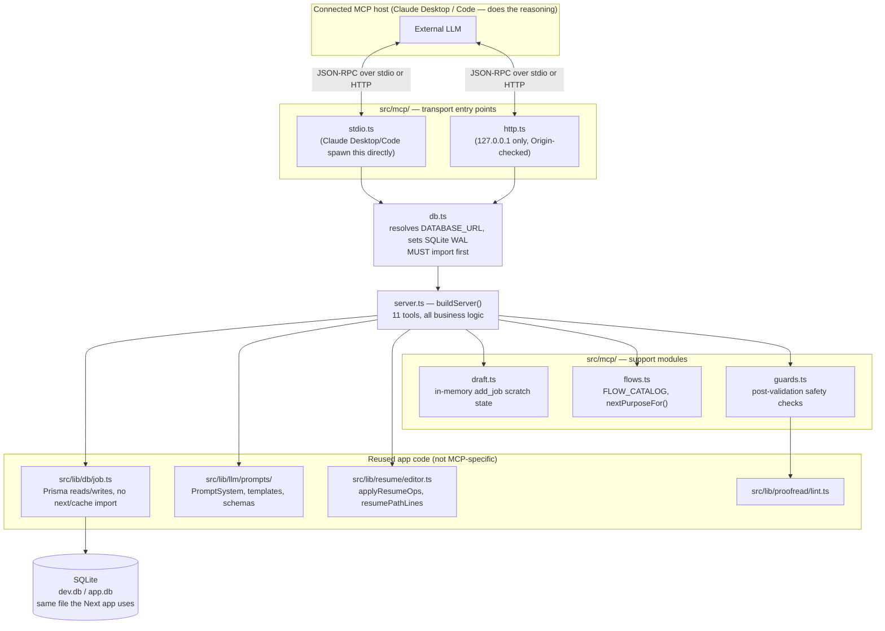
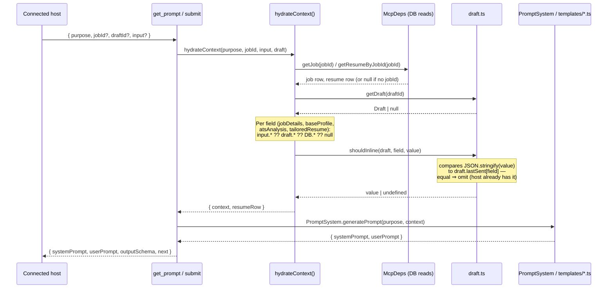
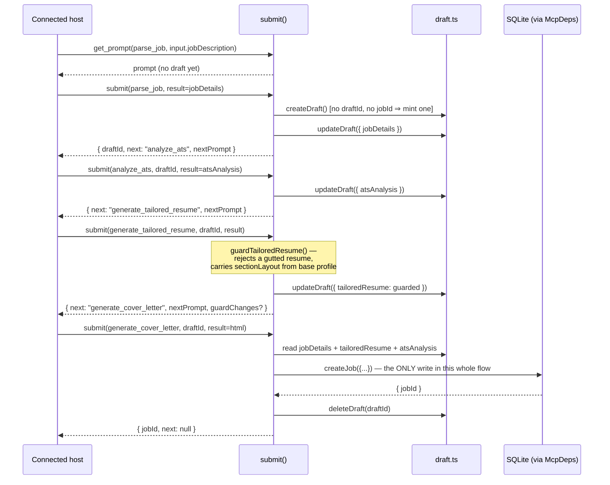
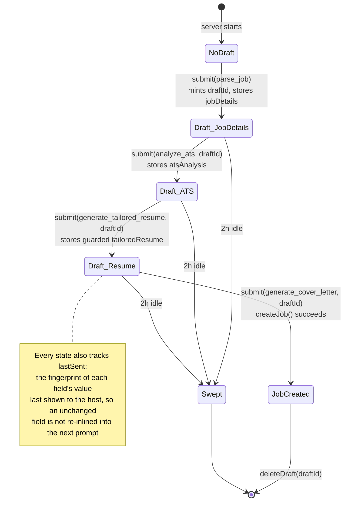
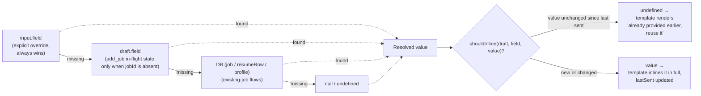
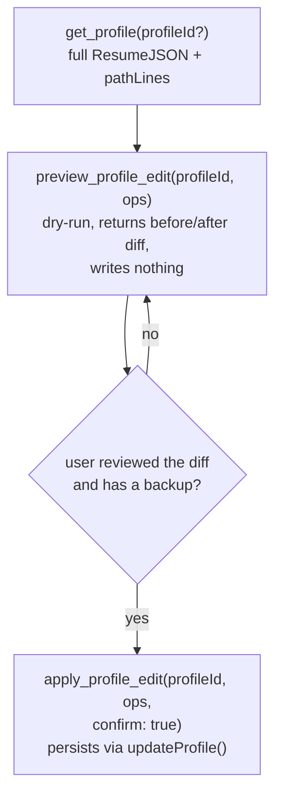
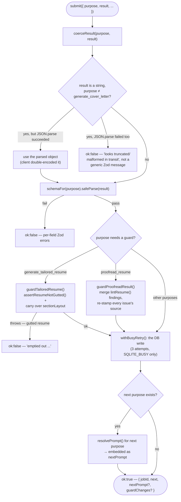
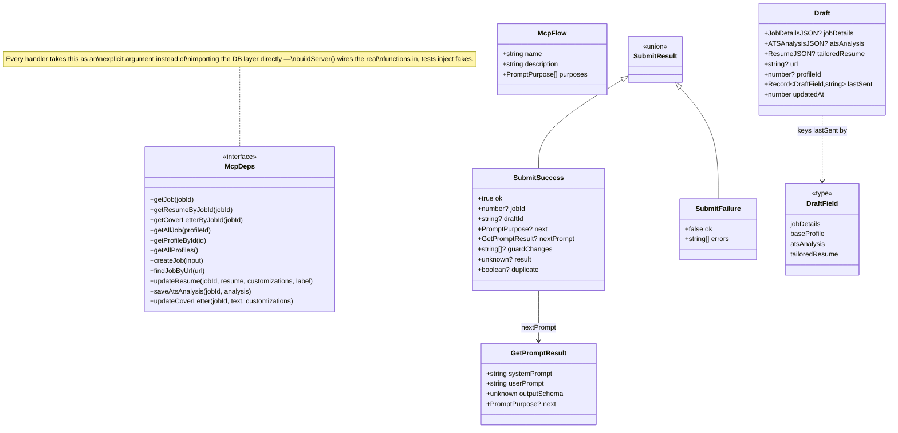

# MCP server architecture

Deep-dive on how `src/mcp/` is built, for anyone extending it later. For
setup/security/troubleshooting see [`MCP.md`](./MCP.md); for the
tool-driving runbook a connected host follows, see
[`skills/resume-mcp/SKILL.md`](../skills/resume-mcp/SKILL.md). This doc is
about the code, not how to use it.

## 1. Where it sits

The MCP server is a thin, additive layer: two process entry points
(`stdio.ts` / `http.ts`) wrap one shared tool definition (`server.ts`),
which reuses this app's _existing_ prompt/validation/persistence code
rather than reimplementing any of it. It never calls an LLM and never
touches API keys — the connected host (Claude Desktop, Claude Code, etc.)
does the reasoning; this server only serves prompts and persists whatever
structured JSON comes back.

## 2. Tool surface

11 tools, all registered in `buildServer()`. `readOnlyHint`/`idempotentHint`
annotations (native to `@modelcontextprotocol/sdk`) tell a host which calls
are safe to retry or skip confirming.

| Tool                   | Read-only?      | Purpose                                                                                |
| ---------------------- | --------------- | -------------------------------------------------------------------------------------- |
| `list_flows`           | ✅              | Static catalog of every flow and its purpose order                                     |
| `get_prompt`           | ✅              | Resolve a purpose's `systemPrompt`/`userPrompt`/`outputSchema`                         |
| `submit`               | ❌              | Validate → guard → persist a result; returns `nextPrompt` inline                       |
| `apply_resume_ops`     | ❌ (idempotent) | Apply JSON-Patch-style ops to a job's resume                                           |
| `list_profiles`        | ✅              | Base profiles, for `generate_cover_letter`'s/bookmark's profile disambiguation         |
| `list_jobs`            | ✅              | Jobs already tracked in the app                                                        |
| `fetch_url`            | ✅              | Fetch a job posting URL server-side (SSRF-guarded) when a host's own fetch is blocked  |
| `get_job_state`        | ✅              | A job's details, resume path-lines, Skim score, cover-letter presence                  |
| `get_profile`          | ✅              | Full base-profile content + pathLines (MCP-only, see §5)                               |
| `preview_profile_edit` | ✅              | Dry-run profile edit ops, returns a before/after diff, writes nothing (MCP-only)       |
| `apply_profile_edit`   | ❌              | Persist profile edit ops — requires `confirm: true`, warns to back up first (MCP-only) |

There is deliberately no `validate` tool — `submit` already runs the same
schema check before persisting, so a failed `submit` doubles as the dry
run (see [`MCP.md`](./MCP.md)).

## 3. Request lifecycle — a single `get_prompt` / `submit` call

Both tools funnel through the same context-hydration step. `hydrateContext`
resolves what a purpose's prompt needs by merging three sources in
priority order, then `PromptSystem.generatePrompt` (the app's existing
Handlebars template system) turns that context into the actual prompt text.

## 4. `add_job` — the flagship flow

Before a job exists, `submit` has nowhere to persist intermediate results
(`createJob` is all-at-once — see `src/lib/db/job.ts`). The draft store
closes that gap: `jobDetails` → `atsAnalysis` → the tailored resume are
carried forward server-side via `draftId`, and `submit`'s response embeds
the next step's prompt as `nextPrompt`, so the whole flow is **5 tool
calls**, not the 8–14 an older carry-everything-yourself design needed.

## 5. Draft lifecycle

A draft is pure in-memory scratch state (`Map<string, Draft>` in
`draft.ts`) — it dies with the server process and is swept after 2h idle.
It exists only for the stretch of `add_job` before a `jobId` exists.

**`draftId` itself is never carried automatically** — there is no session
concept at the MCP protocol layer, so the _caller_ must pass the same
`draftId` (returned by `parse_job`'s `submit`) on every following call in
the flow. Two failure modes this causes if a host drops it:

- **Omitted entirely**: `jobId == null && draftId == null` mints a brand
  new, empty draft every call — each `submit` "succeeds" but nothing
  accumulates, and the flow only fails once `generate_cover_letter` finds
  no `jobDetails`/`tailoredResume` to create a job with.
- **Wrong/expired `draftId`** (typo, or past the 2h idle sweep): `submit`
  now fails immediately with a clear "draftId not found" error instead of
  silently no-oping the write — this used to fail the same way as the
  omitted case (data silently dropped, confusing error three steps later)
  until that was fixed.

Every draft-phase `submit` response also repeats a `hint` field
(`Pass draftId: "..." on your NEXT call...`) precisely because a host's
context may not still hold the tool description text from earlier in the
conversation by the time it matters.

## 6. Context resolution priority

Every field `hydrateContext` needs follows the same three-source
fallback chain — this is what lets the _same_ purpose serve both the
draft-based `add_job` flow (no `jobId`) and the DB-hydrated flows
(`jobId` present) without branching logic per caller.

## 7. The other seven flows

`add_job` and `bookmark` are the only flows with no `jobId` at the start.
Every other flow passes an existing job's `jobId`, so `hydrateContext` reads
straight from the DB with no draft involved (`pick()`'s `draft === null`
short-circuits to "always inline" — see §6).

`bookmark` is not a separate purpose or a `nextPurposeFor` branch — it's a
persistence choice on `parse_job` itself (`input.bookmark: true`), handled
entirely inside `submitTool`'s `case "parse_job"` before the normal
draft-and-continue path. It returns `next: null` directly rather than
routing through `nextPurposeFor`, and dedupes on `input.url` via
`findJobByUrl` before creating anything.

```mermaid
graph TD
    subgraph edit["edit"]
        E1["get_job_state(jobId)<br/>(if paths unknown)"] --> E2["get_prompt(extract_fields_to_edit)"]
        E2 --> E3["apply_resume_ops(jobId, ops)"]
    end

    subgraph proofread["proofread"]
        P1["get_prompt(proofread_resume, jobId)"] --> P2["submit(...)<br/>lint fixes auto-applied,<br/>LLM issues returned for review"]
        P2 --> P3["apply_resume_ops(jobId, ops)<br/>for reviewed LLM issues"]
    end

    subgraph ats_fix["ats_fix"]
        A1["get_prompt(analyze_ats, jobId)<br/>scores the TAILORED resume,<br/>not the base profile"] --> A2["submit(...)"]
        A2 --> A3["get_prompt(fix_ats_issues, jobId)"]
        A3 --> A4["submit(...)"]
        A4 --> A5["apply_resume_ops(jobId, ops)"]
    end

    subgraph humanize["humanize"]
        H1["get_prompt(humanize_content,<br/>input.userInput REQUIRED —<br/>no DB fallback, throws if missing)"] --> H2["submit(...)"]
    end

    subgraph cover_letter["cover_letter"]
        C1["get_prompt(generate_cover_letter, jobId)"] --> C2["submit(...)"]
    end

    subgraph gap_analysis["gap_analysis"]
        G1["get_prompt(analyze_resume_gaps, jobId)<br/>substantive fit vs the JD,<br/>not keyword/format scoring"] --> G2["submit(...)<br/>validate-only, nothing persisted"]
        G2 --> G3["apply_resume_ops(jobId, ops)<br/>for gaps carrying a resume_fix<br/>(never for missing/seniority gaps)"]
    end

    subgraph bookmark["bookmark (no jobId — like add_job's first step,\nbut stops there)"]
        B1["fetch_url(url)"] --> B2["get_prompt(parse_job)"]
        B2 --> B3["submit(parse_job,<br/>input: { url, bookmark: true })"]
        B3 --> B4{"findJobByUrl(url)<br/>already exists?"}
        B4 -->|yes| B5["ok:true — existing jobId,<br/>duplicate:true, no write"]
        B4 -->|no| B6["createJob({ ...jobDetails, url,<br/>status: BOOKMARKED })<br/>next: null"]
    end
```

## 8. Base-profile editing (MCP-only, standalone)

`get_profile` / `preview_profile_edit` / `apply_profile_edit` are not a
`FLOW_CATALOG` entry — they need no LLM prompt from this server (the host
already has the full profile from `get_profile`, including `pathLines` in
the same format `apply_resume_ops` expects), so there's no `get_prompt`/
`submit` step to model. It's a standalone three-tool propose-then-confirm
sequence instead, reusing `applyResumeOps()` against a `Profile` row's
content (a `ResumeJSON` under a non-schema `label` field — see
`profileDataToResumeJson`/`resumeJsonToProfileData` in
`src/actions/profile.ts`) exactly the same way `apply_resume_ops` does
against a `Resume` row's.

This is MCP-only by design — the in-app chat has its own Profile page UI,
so there's no matching `IntentLabel`. `apply_profile_edit` refuses to write
unless the SAME call passes `confirm: true`; its description and response
both tell the calling host to have the user back up first via Settings →
"Backup & Restore" (the existing full-database JSON export) before
confirming, since a profile edit has no undo from this server.

## 9. Validation, guards, and error surfacing

`submit` runs three layers before anything touches the database. Each is
designed so a failure is reported back structured (`{ ok: false, errors }`)
rather than corrupting state or throwing opaquely.

## 10. Key types

## 11. File reference

| File             | Responsibility                                                                                                                                                             |
| ---------------- | -------------------------------------------------------------------------------------------------------------------------------------------------------------------------- |
| `server.ts`      | All 11 tool handlers, `McpDeps`, `hydrateContext`, `submitTool`, `getProfileTool`/`previewProfileEditTool`/`applyProfileEditTool`, `buildServer()` — the bulk of the logic |
| `draft.ts`       | In-memory `add_job` scratch state + the `lastSent` fingerprint dedup                                                                                                       |
| `flows.ts`       | `FLOW_CATALOG` (data, mirrors §7's diagram) + `nextPurposeFor()` — does not include base-profile editing, see §8                                                           |
| `guards.ts`      | Post-Zod safety checks (`guardTailoredResume`, `guardProofreadResult`) applied inside `submit`, before persistence                                                         |
| `db.ts`          | Bootstrap: resolves `DATABASE_URL`, flips SQLite to WAL — must be imported before `server.ts`                                                                              |
| `stdio.ts`       | Process entry point for Claude Desktop/Code (spawns this directly)                                                                                                         |
| `http.ts`        | Process entry point for URL-based hosts (`127.0.0.1` only, Origin-checked)                                                                                                 |
| `tests/lib/mcp/` | `flows.test.ts`, `guards.test.ts`, `applyResumeOpsTool.test.ts`, `submitTool.test.ts`, `profileEditTools.test.ts`                                                          |

Reused (not MCP-specific): `src/lib/db/job.ts` (Prisma reads/writes with no
`next/cache` import, so the MCP bundle never needs Next resolvable at
runtime), `src/lib/llm/prompts/` (the same template/prompt system the
in-app chat uses), `src/lib/resume/editor.ts` (`applyResumeOps`,
`resumePathLines`), `src/lib/proofread/lint.ts`.
